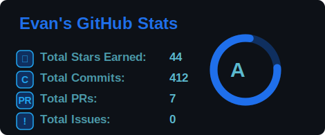
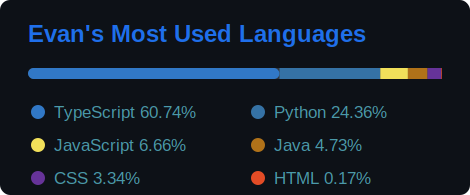

<!-- Animated Header -->

  

  

  
  

## 🧑‍💻 About Me

- 👋 I'm Evan, a young developer building **AI-powered creative tools, animation projects, and developer utilities**.
- 🔭 Currently working on **[Advanced FlipBook Recreation](https://github.com/Evan1108-Coder/Advanced-FlipBook-Recreation)** and **[Setupr](https://github.com/Evan1108-Coder/Setupr)**.
- 🌱 Learning **AI coding, databases, Python, JavaScript, HTML, GitHub, terminals, full-stack development, and AI/ML**.
- 💡 Interested in **AI-powered tools, creative tech, startups, animation, and developer tooling**.
- 🤖 Passionate about **coding with AI, and I believe this is the future**.
- 🎂 Birthday: **November 8**.

## 🛠️ Tech Stack

### 🧩 Languages & Markup

### 🚀 App Development

### 🤖 AI / ML

### ⚙️ Build, Testing & Infra

### 🧰 Tools, Protocols & OS

## 📊 GitHub Highlights

  
  

  

## 📌 Pinned Projects

| Project | What it is |
| --- | --- |
| **[Website-Youtube-File-AI-Scraper](https://github.com/Evan1108-Coder/Website-Youtube-File-AI-Scraper)** | AI-powered Discord bot for summarizing websites, YouTube videos, documents, images, audio clips, and video files with transcript extraction and fallback logic. |
| **[AI-Debate-Council](https://github.com/Evan1108-Coder/AI-Debate-Council)** | Multi-agent debate system where AI models take structured roles, debate through rounds, and synthesize a judged final answer. |
| **[Setupr](https://github.com/Evan1108-Coder/Setupr)** | AI-powered setup CLI that scans codebases, installs dependencies, configures environments, and verifies projects across many stacks. |
| **[PlayWright-Local-Status-Data-Playlens](https://github.com/Evan1108-Coder/PlayWright-Local-Status-Data-Playlens)** | Local-first Playwright observability dashboard for tasks, browser events, terminal output, evidence, exports, and AI-agent context. |
| **[Project-Context-Review-Skill-Claude-Codex](https://github.com/Evan1108-Coder/Project-Context-Review-Skill-Claude-Codex)** | Claude/Codex skill that scans project structure, conventions, architecture, docs, testing, and design context before AI writes code. |

**But honestly, I believe all my projects are useful. Check them all out, and if any project is useful or cool to you, please leave a star. Thanks!**

## 💬 Dev Quote

  

## 🐍 Contribution Snake

  <picture>
    <source media="(prefers-color-scheme: dark)" srcset="https://raw.githubusercontent.com/Evan1108-Coder/Evan1108-Coder/output/github-contribution-grid-snake-dark.svg">
    <source media="(prefers-color-scheme: light)" srcset="https://raw.githubusercontent.com/Evan1108-Coder/Evan1108-Coder/output/github-contribution-grid-snake.svg">
    
  </picture>

  <i>Always building, always learning.</i>

